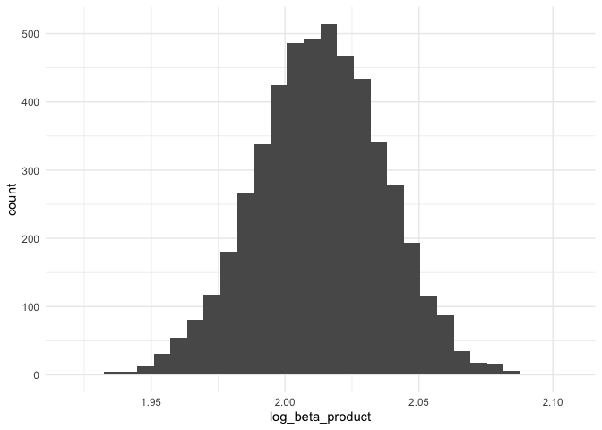

Homework 6
================
mk4995
2024-11-21

## Problem 1

This problem uses the Central Park data that we used earlier in the
semester from `rnoaa`.

``` r
weather_df = 
  rnoaa::meteo_pull_monitors(
    c("USW00094728"),
    var = c("PRCP", "TMIN", "TMAX"), 
    date_min = "2017-01-01",
    date_max = "2017-12-31") %>%
  mutate(
    name = recode(id, USW00094728 = "CentralPark_NY"),
    tmin = tmin / 10,
    tmax = tmax / 10) %>%
  select(name, id, everything())
```

    ## using cached file: /Users/mayakrishnamoorthy/Library/Caches/org.R-project.R/R/rnoaa/noaa_ghcnd/USW00094728.dly

    ## date created (size, mb): 2024-09-26 10:20:07.712277 (8.651)

    ## file min/max dates: 1869-01-01 / 2024-09-30

Start by conducting a simple linear regression (tmax ~ tmin) as a basic
test.

``` r
fit = lm(tmax ~ tmin, data = weather_df)

fit |> broom::tidy()
```

    ## # A tibble: 2 × 5
    ##   term        estimate std.error statistic   p.value
    ##   <chr>          <dbl>     <dbl>     <dbl>     <dbl>
    ## 1 (Intercept)     7.21    0.226       31.8 3.81e-107
    ## 2 tmin            1.04    0.0170      61.2 2.98e-193

``` r
fit |> broom::glance()
```

    ## # A tibble: 1 × 12
    ##   r.squared adj.r.squared sigma statistic   p.value    df logLik   AIC   BIC
    ##       <dbl>         <dbl> <dbl>     <dbl>     <dbl> <dbl>  <dbl> <dbl> <dbl>
    ## 1     0.912         0.911  2.94     3741. 2.98e-193     1  -910. 1827. 1838.
    ## # ℹ 3 more variables: deviance <dbl>, df.residual <int>, nobs <int>

Do some bootstrapping.

``` r
boot_straps = 
  weather_df |> 
  modelr::bootstrap(5000) |> 
  mutate(
    strap = map(strap, as_tibble), 
    models = map(strap, \(df) lm(tmax ~ tmin, data = df)),
    tidy_results = map(models, broom::tidy),
    glance_results = map(models, broom::glance)
  ) |> 
  select(.id, tidy_results, glance_results)
```

Gather results.

``` r
bootstrap_r2 =
  boot_straps |> 
  unnest(glance_results) |> 
  group_by(.id) |> 
  select(.id, r.squared)

bootstrap_log = 
  boot_straps |> 
  unnest(tidy_results) |> 
  select(.id, term, estimate) |> 
  pivot_wider(
    names_from = "term",
    values_from = "estimate"
  ) |> 
  rename(
    b0 = `(Intercept)`,
    b1 = tmin
  ) |> 
  mutate(log_beta_product = log(b0*b1)) |> 
  select(.id, log_beta_product)

bootstrap_results = 
  full_join(bootstrap_r2, bootstrap_log, by = ".id") |> 
  ungroup()

bootstrap_results |> 
  head(20) |> 
  knitr::kable()
```

| .id  | r.squared | log_beta_product |
|:-----|----------:|-----------------:|
| 0001 | 0.9066105 |         2.043075 |
| 0002 | 0.8958830 |         2.029909 |
| 0003 | 0.9178528 |         2.051741 |
| 0004 | 0.8987341 |         2.065853 |
| 0005 | 0.9134470 |         1.973252 |
| 0006 | 0.9186378 |         1.988084 |
| 0007 | 0.9183727 |         1.996379 |
| 0008 | 0.9074658 |         1.999780 |
| 0009 | 0.9162023 |         2.006608 |
| 0010 | 0.9176321 |         2.024745 |
| 0011 | 0.9184521 |         2.002655 |
| 0012 | 0.9076259 |         2.002654 |
| 0013 | 0.9030427 |         2.023893 |
| 0014 | 0.9303775 |         2.000647 |
| 0015 | 0.9260268 |         1.994740 |
| 0016 | 0.8953363 |         2.047541 |
| 0017 | 0.9072232 |         2.008369 |
| 0018 | 0.9054582 |         2.020722 |
| 0019 | 0.9144758 |         2.034640 |
| 0020 | 0.9097231 |         2.008622 |

The table above shows the first 20 rows of data.

``` r
bootstrap_results |> 
  ggplot(aes(x = r.squared)) + geom_histogram() + theme_minimal()
```

    ## `stat_bin()` using `bins = 30`. Pick better value with `binwidth`.

<!-- -->

The distribution of the `R-squared` values from bootstrapping 5000
samples is relatively normal with the center of the distribution around
0.91. Almost all values are contained between 0.88 and 0.94.

``` r
bootstrap_results |> 
  ggplot(aes(x = log_beta_product)) + geom_histogram() + theme_minimal()
```

    ## `stat_bin()` using `bins = 30`. Pick better value with `binwidth`.

<!-- -->

The distribution of the `log(B1 * B2)` values from bootstrapping 5000
samples is also relatively normal with the center of the distribution
around 2.02. Almost all values are contained between 1.94 and 2.08.

Create confidence intervals.

``` r
bootstrap_results |> 
  dplyr::summarize(
    r_squared_mean = mean(r.squared),
    r_squared_ci_ll = quantile(r.squared, 0.025),
    r_squared_ci_ul = quantile(r.squared, 0.975),
    log_beta_product_mean = mean(log_beta_product),
    log_product_ci_ll = quantile(log_beta_product, 0.025),
    log_product_ci_ul = quantile(log_beta_product, 0.975)
  ) |> 
  knitr::kable()
```

| r_squared_mean | r_squared_ci_ll | r_squared_ci_ul | log_beta_product_mean | log_product_ci_ll | log_product_ci_ul |
|---------------:|----------------:|----------------:|----------------------:|------------------:|------------------:|
|      0.9113306 |       0.8936684 |        0.927106 |              2.013103 |          1.964949 |          2.058887 |
