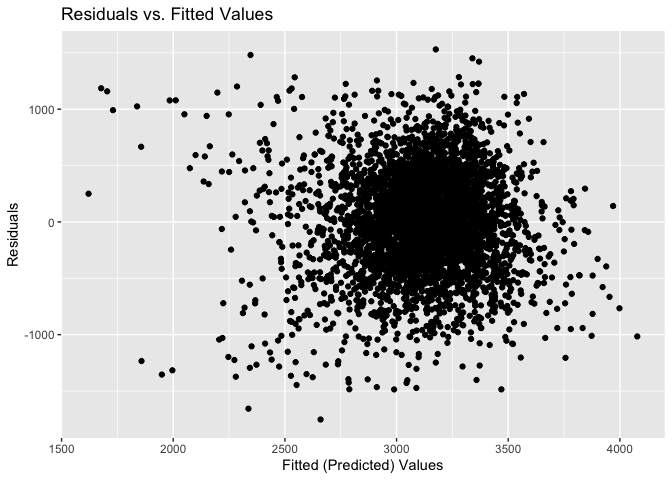

Homework 6
================
mk4995
2024-11-21

## Problem 1

This problem uses the Central Park data that we used earlier in the
semester from `rnoaa`.

``` r
weather_df = 
  rnoaa::meteo_pull_monitors(
    c("USW00094728"),
    var = c("PRCP", "TMIN", "TMAX"), 
    date_min = "2017-01-01",
    date_max = "2017-12-31") %>%
  mutate(
    name = recode(id, USW00094728 = "CentralPark_NY"),
    tmin = tmin / 10,
    tmax = tmax / 10) %>%
  select(name, id, everything())
```

Do some bootstrapping.

``` r
boot_straps = 
  weather_df |> 
  modelr::bootstrap(5000) |> 
  mutate(
    strap = map(strap, as_tibble), 
    models = map(strap, \(df) lm(tmax ~ tmin, data = df)),
    tidy_results = map(models, broom::tidy),
    glance_results = map(models, broom::glance)
  ) |> 
  select(.id, tidy_results, glance_results)
```

Gather results.

``` r
bootstrap_r2 =
  boot_straps |> 
  unnest(glance_results) |> 
  group_by(.id) |> 
  select(.id, r.squared)

bootstrap_log = 
  boot_straps |> 
  unnest(tidy_results) |> 
  select(.id, term, estimate) |> 
  pivot_wider(
    names_from = "term",
    values_from = "estimate"
  ) |> 
  mutate(log_beta_product = log(`(Intercept)`*tmin)) |> 
  select(.id, log_beta_product)

bootstrap_results = 
  full_join(bootstrap_r2, bootstrap_log, by = ".id") |> 
  ungroup()

bootstrap_results |> 
  head(10) |> 
  knitr::kable()
```

| .id  | r.squared | log_beta_product |
|:-----|----------:|-----------------:|
| 0001 | 0.9066105 |         2.043075 |
| 0002 | 0.8958830 |         2.029909 |
| 0003 | 0.9178528 |         2.051741 |
| 0004 | 0.8987341 |         2.065853 |
| 0005 | 0.9134470 |         1.973252 |
| 0006 | 0.9186378 |         1.988084 |
| 0007 | 0.9183727 |         1.996379 |
| 0008 | 0.9074658 |         1.999780 |
| 0009 | 0.9162023 |         2.006608 |
| 0010 | 0.9176321 |         2.024745 |

The table above shows the first 10 rows of data.

``` r
bootstrap_results |> 
  ggplot(aes(x = r.squared)) + geom_density() + theme_minimal()
```

<!-- -->

The distribution of the `R-squared` values from bootstrapping 5000
samples is approximately normal with the center of the distribution
around 0.91. Almost all values are contained between 0.88 and 0.94.

``` r
bootstrap_results |> 
  ggplot(aes(x = log_beta_product)) + geom_density() + theme_minimal()
```

<!-- -->

The distribution of the `log(B0 * B1)` values from bootstrapping 5000
samples is also relatively normal with the center of the distribution
around 2.02. Almost all values are contained between 1.94 and 2.08.

Create confidence intervals.

``` r
bootstrap_summary = 
  bootstrap_results |> 
  dplyr::summarize(
    r_squared_mean = mean(r.squared),
    r_squared_ci_ll = quantile(r.squared, 0.025),
    r_squared_ci_ul = quantile(r.squared, 0.975),
    log_beta_product_mean = mean(log_beta_product),
    log_product_ci_ll = quantile(log_beta_product, 0.025),
    log_product_ci_ul = quantile(log_beta_product, 0.975)
  )

bootstrap_summary |>
  knitr::kable()
```

| r_squared_mean | r_squared_ci_ll | r_squared_ci_ul | log_beta_product_mean | log_product_ci_ll | log_product_ci_ul |
|---------------:|----------------:|----------------:|----------------------:|------------------:|------------------:|
|      0.9113306 |       0.8936684 |        0.927106 |              2.013103 |          1.964949 |          2.058887 |

The 95% confidence interval for `r^2` is (0.8936684, 0.927106). The 95%
confidence interval for `log beta product` is (1.9649487, 2.0588875).

## Problem 2

Import the Washington Post data on homicides in 50 large U.S. cities.

``` r
url = "https://raw.githubusercontent.com/washingtonpost/data-homicides/master/homicide-data.csv"
homicide_data = read_csv(url)
```

**Clean the data** by creating a city-state variable and a binary
variable indicating whether the homicide is solved. Omit cities Dallas,
TX; Phoenix, AZ; Kansas City, MO; and Tulsa, AL. For this problem, limit
your analysis those for whom victim_race is white or black. Be sure that
victim_age is numeric.

``` r
homicide_data = 
  homicide_data |> 
  mutate(
    city_state = str_c(city, state, sep = ", "),
    solved = ifelse(disposition == "Closed by arrest", 1, 0),
    victim_age = as.numeric(victim_age)
  ) |> 
  filter(
    !(city_state %in% c("Dallas, TX", "Phoenix, AZ", "Kansas City, MO", "Tulsa, AL")),
    victim_race %in% c("White", "Black")
  )
```

    ## Warning: There was 1 warning in `mutate()`.
    ## ℹ In argument: `victim_age = as.numeric(victim_age)`.
    ## Caused by warning:
    ## ! NAs introduced by coercion

**Use the `glm` function to fit a logistic regression with resolved vs
unresolved homicides as the outcome and victim age, sex and race as
predictors for Baltimore, MD.**

``` r
baltimore_homicides = 
  homicide_data |> 
  filter(city_state == "Baltimore, MD")

baltimore_glm = 
  baltimore_homicides |> 
  glm(solved ~ victim_age + victim_sex + victim_race, 
      data = _,
      family = binomial())
```

Save the output of glm as an R object; apply `broom::tidy` to this
object; and **obtain the estimate and confidence interval of the
adjusted odds ratio for solving homicides comparing male victims to
female victims keeping all other variables fixed.**

``` r
baltimore_or_results = 
  baltimore_glm |> 
  broom::tidy() |> 
  mutate(
    OR = exp(estimate),
    OR_ci_ll = exp(estimate - 1.96 * std.error),
    OR_ci_ul = exp(estimate + 1.96 * std.error)
  ) |> 
  filter(term == "victim_sexMale") |> 
  select(OR, OR_ci_ll, OR_ci_ul)

baltimore_or_results |>
  knitr::kable(digits=3)
```

|    OR | OR_ci_ll | OR_ci_ul |
|------:|---------:|---------:|
| 0.426 |    0.325 |    0.558 |

The confidence interval for the adjusted OR for solving homicides
comparing male victims to female victims is (0.324559, 0.5578655).

**Now run `glm` for each of the cities in the dataset and extract the
adjusted odds ratio (and CI) for solving homicides comparing male
victims to female victims.**

``` r
homicides_glm = 
  homicide_data |> 
  nest(data = -city_state) |> 
  mutate(
    models = map(data, \(df) glm(
      solved ~ victim_age + victim_sex + victim_race, 
      data = df, 
      family = binomial())
    ),
    results = map(models, broom::tidy)) |> 
  select(-data, -models) |> 
  unnest(results)

homicide_ORs = 
  homicides_glm |> 
  mutate(
    OR = exp(estimate),
    OR_ci_ll = exp(estimate - 1.96 * std.error),
    OR_ci_ul = exp(estimate + 1.96 * std.error)
  ) |> 
  filter(term == "victim_sexMale") |> 
  select(city_state, OR, OR_ci_ll, OR_ci_ul)

homicide_ORs |> 
  head(10) |> 
  knitr::kable()
```

| city_state      |        OR |  OR_ci_ll |  OR_ci_ul |
|:----------------|----------:|----------:|----------:|
| Albuquerque, NM | 1.7674995 | 0.8306581 | 3.7609388 |
| Atlanta, GA     | 1.0000771 | 0.6836012 | 1.4630669 |
| Baltimore, MD   | 0.4255117 | 0.3245590 | 0.5578655 |
| Baton Rouge, LA | 0.3814393 | 0.2092532 | 0.6953103 |
| Birmingham, AL  | 0.8700153 | 0.5742951 | 1.3180098 |
| Boston, MA      | 0.6739912 | 0.3560002 | 1.2760222 |
| Buffalo, NY     | 0.5205704 | 0.2897705 | 0.9352008 |
| Charlotte, NC   | 0.8838976 | 0.5569929 | 1.4026659 |
| Chicago, IL     | 0.4100982 | 0.3359897 | 0.5005527 |
| Cincinnati, OH  | 0.3998277 | 0.2360847 | 0.6771390 |

The table above shows the first 10 rows of our OR dataframe for each
city. There are 47 rows in total.

**Create a plot that shows the estimated ORs and CIs for each city.
Organize cities according to estimated OR, and comment on the plot.**

``` r
homicide_ORs |> 
  arrange(OR) |> 
  mutate(city_state = factor(city_state, levels = city_state)) |> 
  ggplot(aes(x = city_state, y = OR)) +
  geom_point() +
  geom_errorbar(aes(ymin = OR_ci_ll, ymax = OR_ci_ul)) +
  labs(
    title = "Estimated ORs and CIs of Solved vs. Unsolved Homicides by City for Male vs. Female Victims",
    x = "City, State",
    y = "Estimated OR of Solved Homicides"
  ) +
  theme(axis.text.x = element_text(angle = 90, vjust = 0.5, hjust = 1))
```

<!-- -->

From the plot, we can see that most adjusted OR estimates are below 1
across the 47 cities, meaning that male victims are less likely to have
their homicides solved compared to female victims. However, since some
confidence intervals also include 1, we must be careful to mak that
generalization. Only in those cities where the confidence interval does
not include 1 can we say that male victims are *significantly* less
likely to have their homicides solved compared to female victims. New
York has the smallest odds ratio, so we’d say that the disparity between
solved cases for male vs. female victims is the biggest there.
Albuqerque has the highest odds ratio, but since the 95% CI includes 1,
we cannot generalize any significant difference in solved male victim
cases vs. female victim cases.

## Problem 3

**Analyze data gathered to understand the effects of several variables
on a child’s birthweight.**

Load and clean the data for regression purposes.

``` r
bwt = read_csv("data/birthweight.csv") |> 
  janitor::clean_names()
```

    ## Rows: 4342 Columns: 20
    ## ── Column specification ────────────────────────────────────────────────────────
    ## Delimiter: ","
    ## dbl (20): babysex, bhead, blength, bwt, delwt, fincome, frace, gaweeks, malf...
    ## 
    ## ℹ Use `spec()` to retrieve the full column specification for this data.
    ## ℹ Specify the column types or set `show_col_types = FALSE` to quiet this message.

``` r
bwt =
  bwt |> 
  mutate(
        babysex = 
            case_match(babysex, 
                1 ~ "male", 
                2 ~ "female"),
        babysex = fct_infreq(babysex),
        frace = 
            case_match(frace,
                1 ~ "white", 
                2 ~ "black", 
                3 ~ "asian",
                4 ~ "puerto rican", 
                8 ~ "other"),
        frace = fct_infreq(frace), 
        mrace = 
        case_match(mrace,
            1 ~ "white", 
            2 ~ "black", 
            3 ~ "asian",
            4 ~ "puerto rican", 
            8 ~ "other"),
    mrace = fct_infreq(mrace),
    malform = 
      case_match(malform,
                 0 ~ "absent",
                 1 ~ "present"),
    malform = fct_infreq(malform)
  )
```

Check for missing data.

``` r
any(is.na(bwt))
```

    ## [1] FALSE

To create my regression model for birthweight, I searched on Google
Scholar for articles related to “factors affecting birthweight”. One
article titled “Factors influencing the birth weight in normal
pregnancy” (found here:
<https://www.sciencedirect.com/science/article/abs/pii/0002937865902486>)
hypothesized that birthweight is affected by the following factors of
interest that are also included in this dataset:

- Sex and gestational age of the infant

- Weight, height, body build of the mother, and of the maternal weight
  gain during pregnancy

I will create a model only using the simple effects of the factors
above.

``` r
bwt_model = 
  bwt |> 
  lm(bwt ~ babysex + gaweeks + wtgain + mheight , data = _)
```

Plot model residuals against fitted values.

``` r
bwt |> 
  modelr::add_predictions(bwt_model) |> 
  modelr::add_residuals(bwt_model) |> 
  ggplot(aes(x = pred, y = resid)) +
  geom_point() + 
  labs(
    title = "Residuals vs. Fitted Values",
    x = "Fitted (Predicted) Values",
    y = "Residuals"
  )
```

<!-- -->

Compare my model to two other models.

- `model1`: One using length at birth and gestational age as predictors
  (main effects only)

- `model2`: One using head circumference, length, sex, and all
  interactions (including the three-way interaction) between these

``` r
model1 = 
  bwt |> 
  lm(bwt ~ blength + gaweeks, data = _)

model2 = 
  bwt |> 
  lm(bwt ~ bhead + blength + babysex + bhead*blength + bhead*babysex + blength*babysex + bhead*blength*babysex, data = _)
```

Make this comparison in terms of the cross-validated prediction error.

``` r
cv_df = 
  crossv_mc(bwt, 100) %>% 
  mutate(
    train = map(train, as_tibble),
    test = map(test, as_tibble)
  )

cv_res_df =
  cv_df |> 
  mutate(
    model1 = map(train, \(x) lm(bwt ~ babysex + gaweeks + wtgain + mheight , data = x)),
    model2 = map(train, \(x) lm(bwt ~ blength + gaweeks, data = x)),
    model3 = map(train, \(x) lm(bwt ~ bhead + blength + babysex + bhead*blength + bhead*babysex + blength*babysex + bhead*blength*babysex, data = x))
  ) |> 
  mutate(
    rmse_model1 = map2_dbl(model1, test, rmse),
    rmse_model2 = map2_dbl(model2, test, rmse),
    rmse_model3 = map2_dbl(model3, test, rmse)
  )
```

``` r
cv_res_df |> 
  select(starts_with("rmse")) |> 
  pivot_longer(
    everything(),
    names_to = "model", 
    values_to = "rmse",
    names_prefix = "rmse_"
  ) |> 
  ggplot(aes(x = model, y = rmse, fill = model)) + 
  geom_violin()
```

<!-- -->

My model had the highest RMSE distribution, whereas model 3 (which
included the interactions) has the lowest distribution. Thus, we can
conclude that the last model has the best predictive accuracy.
